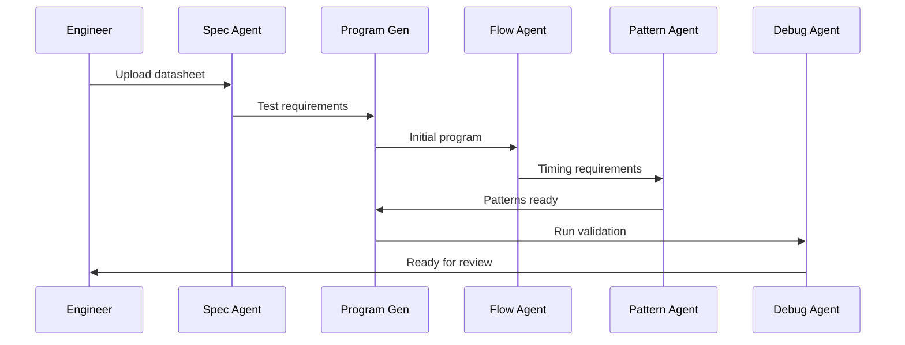
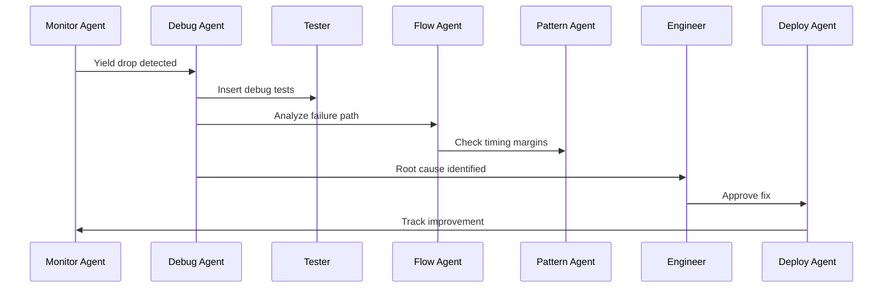

# Multi-Agent AI Ecosystem for Test Engineering
## From Knowledge Retrieval to Autonomous Test Development

---

## Vision Statement

Transform our current RAG assistant into a comprehensive **Multi-Agent AI Ecosystem** that autonomously handles the entire test engineering lifecycle - from initial specification to real-time debugging on production testers. This represents a paradigm shift from "AI-assisted" to "AI-automated" test development.

---

## The Agent Ecosystem Architecture

### Core Philosophy
Each agent specializes in a specific domain of test engineering, working collaboratively to deliver end-to-end automation while maintaining human oversight at critical decision points.

```
┌─────────────────────────────────────────────────────────────┐
│                    ORCHESTRATOR AGENT                       │
│            (Coordinates all agents, manages workflow)       │
└────────────┬────────────────────────────────────┬───────────┘
             │                                    │
    ┌────────▼────────┐                  ┌───────▼────────┐
    │  PLANNING LAYER │                  │ EXECUTION LAYER │
    └────────┬────────┘                  └───────┬────────┘
             │                                    │
      ┌──────┼──────┬──────┬──────┐      ┌──────┼──────┬──────┐
      │      │      │      │      │      │      │      │      │
   Spec   Program  Flow  Pattern  DUT    Debug  Deploy  Monitor
   Agent   Gen    Agent  Agent   Agent   Agent  Agent   Agent
```

---

## Specialized Agent Portfolio

### 1. 📋 **Specification Analysis Agent**
**Purpose**: Transform device specifications into test requirements

**Capabilities**:
- Parse device datasheets and specifications
- Extract testable parameters automatically
- Generate test coverage matrices
- Identify critical test points from specs
- Create preliminary test plans

**Business Value**:
- 50% reduction in test plan creation time
- Ensures 100% spec coverage
- Eliminates human oversight errors

---

### 2. 🔧 **Test Program Generation Agent**
**Purpose**: Automatically generate complete test programs from specifications

**Capabilities**:
- Generate TML code from test requirements
- Create pattern files for digital tests
- Build test method libraries
- Implement industry-standard test algorithms
- Generate multi-site test configurations

**Example Interaction**:
```
Engineer: "Generate DC parametric tests for ADC channels 0-7 with 12-bit resolution"
Agent: [Generates complete TML test suite with calibration, linearity, and noise tests]
```

**Business Value**:
- 70% reduction in initial program development time
- Consistent code quality and structure
- Built-in best practices

---

### 3. 🔄 **Test Flow Optimization Agent**
**Purpose**: Optimize test execution flow for throughput and coverage

**Capabilities**:
- Analyze test dependencies and parallelize where possible
- Optimize binning strategies
- Implement adaptive test algorithms
- Balance test time vs. coverage trade-offs
- Generate optimal test insertion points

**Intelligence Features**:
- ML-based test time prediction
- Dynamic flow adjustment based on yield data
- Automatic parallel test identification

**Business Value**:
- 25-40% test time reduction
- Improved first-pass yield
- Reduced cost of test

---

### 4. 🎯 **Pattern Generation Agent**
**Purpose**: Create and optimize digital patterns for device testing

**Capabilities**:
- Generate timing patterns from specifications
- Create scan patterns automatically
- Optimize pattern compression
- Implement BIST coordination
- Handle complex protocol patterns (SPI, I2C, MIPI, etc.)

**Advanced Features**:
- Automatic timing margin analysis
- Pattern validation and simulation
- Cross-reference with device timing specs

---

### 5. 🔌 **DUT Board Design Agent**
**Purpose**: Assist in Device Under Test board design and validation

**Capabilities**:
- Generate DUT board netlists from pinout
- Validate signal integrity requirements
- Create resource allocation maps
- Generate loadboard configuration files
- Implement automatic relay switching patterns

**Integration Points**:
- Direct interface with CAD tools
- Automatic BOM generation
- Resource conflict detection

---

### 6. 🐛 **Real-Time Debug Agent**
**Purpose**: Autonomous debugging during test execution

**Capabilities**:
- Monitor test execution in real-time
- Identify failure patterns automatically
- Suggest root cause analysis paths
- Generate debug test insertions on-the-fly
- Correlate failures across sites and lots

**Revolutionary Features**:
- **Live Tester Integration**: Direct connection to UltraFlex during execution
- **Automatic Shmoo Generation**: Creates characterization tests when failures detected
- **Pattern-Based Failure Analysis**: Uses ML to identify systematic issues
- **Automatic Debug Report Generation**: Documents findings and solutions

**Example Scenario**:
```
During Production:
- Agent detects unusual failure pattern on Pin 42
- Automatically inserts characterization test
- Identifies timing marginality at high temperature
- Suggests pattern timing adjustment
- Implements fix after engineer approval
- Validates fix across multiple devices
```

---

### 7. 🚀 **Deployment & Release Agent**
**Purpose**: Manage test program deployment to production

**Capabilities**:
- Validate test programs against production requirements
- Manage version control and releases
- Generate correlation reports
- Handle multi-site deployment
- Implement gradual rollout strategies

**Safety Features**:
- Automatic rollback on correlation failures
- Guard-band validation
- Change impact analysis

---

### 8. 📊 **Production Monitor Agent**
**Purpose**: Continuous monitoring and optimization in production

**Capabilities**:
- Real-time yield monitoring
- Test time optimization suggestions
- Outlier detection and analysis
- Predictive maintenance alerts
- Automatic report generation

**Intelligence Layer**:
- ML-based yield prediction
- Anomaly detection algorithms
- Test effectiveness scoring

---

## Agent Collaboration Scenarios

### Scenario 1: New Device Introduction


### Scenario 2: Production Issue Resolution


---

## Implementation Roadmap

### Phase 1: Foundation (Q2-Q3 2024)
**Focus**: Enhance current RAG with agent capabilities

- ✅ Current RAG system (COMPLETE)
- 🔄 Migrate to LangChain for agent support
- ⬜ Implement Orchestrator Agent framework
- ⬜ Deploy Specification Analysis Agent
- ⬜ Create inter-agent communication protocol

**Deliverables**: Working spec-to-requirements pipeline

---

### Phase 2: Generation Agents (Q4 2024 - Q1 2025)
**Focus**: Automated test program creation

- ⬜ Test Program Generation Agent
- ⬜ Pattern Generation Agent
- ⬜ Flow Optimization Agent (basic)
- ⬜ Integration with IG-XL IDE

**Deliverables**: 60% automated program generation

---

### Phase 3: Real-Time Integration (Q2-Q3 2025)
**Focus**: Live tester connection and debugging

- ⬜ Real-Time Debug Agent
- ⬜ Direct UltraFlex API integration
- ⬜ Production Monitor Agent
- ⬜ Automatic shmoo and characterization

**Deliverables**: Autonomous debug capability

---

### Phase 4: Full Autonomy (Q4 2025 - Q1 2026)
**Focus**: End-to-end automation

- ⬜ DUT Board Design Agent
- ⬜ Deployment & Release Agent
- ⬜ Advanced ML optimization
- ⬜ Cross-platform support (93K, J750)

**Deliverables**: Full lifecycle automation

---

## Technical Architecture

### Core Technologies
```yaml
Agent Framework:
  - LangChain / LangGraph for agent orchestration
  - AutoGen for multi-agent collaboration
  - Vector databases for knowledge persistence

AI Models:
  - GPT-4o for code generation
  - Claude 3 Opus for complex reasoning
  - Codex for pattern generation
  - Custom fine-tuned models for ADI-specific tasks

Integration Layer:
  - REST APIs for tester communication
  - gRPC for high-speed data transfer
  - WebSocket for real-time monitoring
  - MQTT for event streaming

Development Stack:
  - Python for agent logic
  - Rust for performance-critical paths
  - React for monitoring dashboards
  - Kubernetes for scalable deployment
```

### Data Flow Architecture
```
Testers → Event Stream → Monitor Agent → Analysis Pipeline → Action Agents → Tester Commands
    ↑                                                                              ↓
    └──────────────────────── Feedback Loop ──────────────────────────────────────┘
```

---

## Expected Outcomes & Metrics

### Productivity Gains
| Metric | Current | With Agents | Improvement |
|--------|---------|-------------|-------------|
| Test Program Development | 2 weeks | 3 days | **85%** |
| Debug Time | 8 hours | 1 hour | **87%** |
| Pattern Generation | 3 days | 4 hours | **92%** |
| Production Issues MTTR | 4 hours | 30 mins | **87%** |
| Test Coverage | 85% | 99% | **16%** |

### Financial Impact
- **Development Cost Reduction**: $2.5M annually
- **Test Time Reduction**: 30% → $4M savings/year
- **Yield Improvement**: 2% → $6M additional revenue
- **Total Annual Impact**: ~$12.5M

### Strategic Benefits
- **Competitive Advantage**: First-to-market with AI-automated test
- **Scalability**: Support 10x more devices with same headcount
- **Quality**: Consistent, optimized test programs
- **Knowledge Capture**: Institutionalize expertise in AI agents

---

## Risk Management

### Technical Risks
| Risk | Mitigation |
|------|------------|
| AI Hallucination | Human-in-the-loop validation at critical points |
| Integration Complexity | Phased rollout with fallback mechanisms |
| Model Accuracy | Continuous learning from production data |
| Tester Compatibility | Abstract interface layer for multi-platform support |

### Organizational Risks
| Risk | Mitigation |
|------|------------|
| Adoption Resistance | Gradual introduction, extensive training |
| Skill Gap | Upskilling programs for engineers |
| Over-reliance on AI | Maintain manual override capabilities |

---

## Investment Requirements

### Resources Needed
- **Team Expansion**: 
  - 2 Senior AI Engineers
  - 1 Test Engineering Domain Expert
  - 1 DevOps Engineer
  - 1 UI/UX Developer

- **Infrastructure**:
  - GPU cluster for model training
  - High-availability deployment infrastructure
  - Real-time data pipeline architecture

- **Licensing**:
  - Enterprise AI model access
  - Advanced development tools
  - Tester API access licenses

### Estimated Budget
- **Year 1**: $1.2M (team + infrastructure setup)
- **Year 2**: $800K (scaling + optimization)
- **ROI Break-even**: Month 14

---

## Success Criteria

### Short-term (6 months)
- ✓ 3 working specialized agents
- ✓ 50% reduction in test plan creation time
- ✓ Successful pilot with one product line

### Medium-term (12 months)
- ✓ 5+ integrated agents
- ✓ Full program generation for standard devices
- ✓ Production deployment on 10+ programs

### Long-term (24 months)
- ✓ Complete agent ecosystem operational
- ✓ 80% test development automation
- ✓ Expansion to multiple test platforms
- ✓ Industry recognition as innovation leader

---

## Call to Action

This multi-agent ecosystem represents the future of semiconductor test engineering. With your support, we can:

1. **Pioneer** the industry's first AI-automated test development platform
2. **Transform** how ADI develops and deploys test programs
3. **Establish** ADI as the innovation leader in AI-enabled test

**Next Steps**:
1. Approve Phase 1 funding and resources
2. Form cross-functional steering committee
3. Establish pilot program with willing product line
4. Begin recruiting specialized talent

---

## Conclusion

*"From one assistant to an army of specialized agents - revolutionizing test engineering through AI collaboration"*

This is not just an evolution of our current RAG system - it's a revolution in how we approach test engineering. The competitive advantage gained from this initiative will position ADI as the undisputed leader in intelligent test solutions.

**The future of test is autonomous. Let's build it together.**

---

**Contact**: [Your Name]  
**Current System**: `C:\AI Projects\page_indexing_RAG`  
**Vision Document**: `C:\AI Projects\page_indexing_RAG\AGENT_ECOSYSTEM_VISION.md`  
**Prototype Timeline**: Q2 2024 - Q1 2026